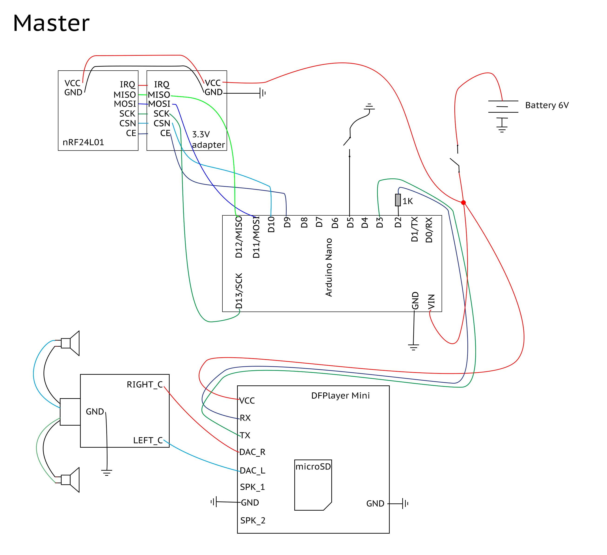
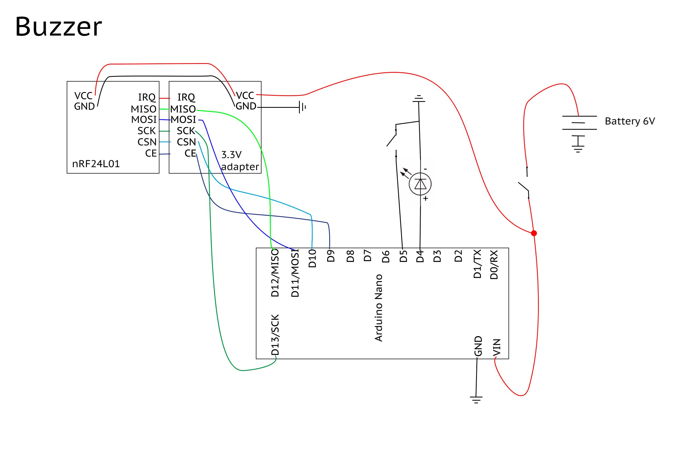

## Game Show Buzzer System
Wireless Arduino Nano / NRF24l01 Buzzer system with Game-Master to reset the buzzer states. Only one Buzzer can "win". Each Buzzer trigger can have it's own audio playback.

")

*click the image to play the demo video of the buzzer system*

**Arduino Setup**
- Copy NF24* folders to your your Arduino folder
- Install library [RF24 by TMRh20](http://tmrh20.github.io/RF24/)
- Install Library [DFPlayer Mini](https://github.com/DFRobot/DFRobotDFPlayerMini)

### Master
The game master controls the buzzers. It receives signal from the pressed buzzers and determines, who wins the race and plays the corresponding sound. The winner receives the "light on" signal.

[Source code for master](NF24-BK-MASTER/NF24-BK-MASTER.ino)

#### Circuit Layout

**Parts** (Master)
- Arduino Nano
- NRF24l01
- NRF24L01 3.3V Adapter
- Touch Button (to reset lock)
- ON/OFF switcher
- DFPlayer Mini + microSD card
- 1K resistor
- 3.5mm Socket Audio Jack Connector PCB

### Buzzer
The buzzer sends a button press to the master. Only if the buzzer "wins", the buzzer receives the command to turn on the light.

[Source code for the buzzer](NF24-BK-BUZZER/NF24-BK-BUZZER.ino)

#### Circuit Layout

**Parts**
- Arduino Nano
- NRF24l01
- NRF24L01 3.3V Adapter
- LED (buzzer light)
- Touch Button (buzzer)
- ON/OFF switcher
